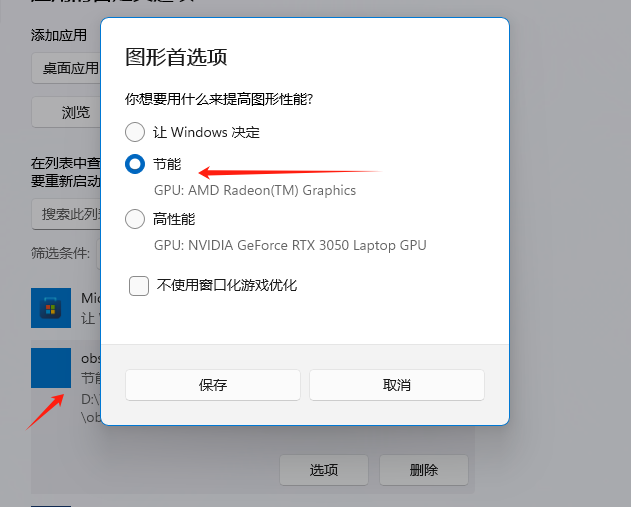

# Very simple example of [obs-studio-node] usage
```
首先请允许我吐槽一下obs-studio-node 
阿巴阿巴阿巴 
```

## 环境与版本
```
node: v12.16.3
electron: v10.2.0
yarn: v1.22.21
obs-studio-node: https://s3-us-west-2.amazonaws.com/obsstudionodes3.streamlabs.com/osn-0.15.6-release-win64.tar.gz
```

## 参照说明
```
本着开源学习的态度，对github中的一些项目进行了参考借鉴。以下是参考的项目

[streamlabs-obs](https://github.com/stream-labs/streamlabs-obs) : github上开源的obs软件，目前已经上线，自行百度下载，主要参考此软件进行调用
[OBS-Studio](https://obsproject.com/zh-cn) : 同样也是github上开源的obs软件，以上两款软件对obs-studio-node都进行了一定程度的封装，不过仔细耐心的开下去还是可以讲究明白的
[obs-studio-node-example](https://github.com/Envek/obs-studio-node-example) : 本实例主要参考了此demo示例，感谢作者的开源奉献（此demo做了mac系统兼容，可用作参考）
[obs-example](https://github.com/qlteacher/obs-example) : 相同的obs-studio-node的demo示例
```

## 兼容问题
```
由于本人使用的windows系统的电脑，所以demo可能在mac系统兼容上做的不是很好，
如果你使用了mac系统请引入node-window-rendering 此依赖，从而兼容mac系统（最好使用yarn引入）
```
  
**<font color=#FF0000 >Windows端注意，如果你的电脑是双显卡，请阅读下面的文字</font>**

对于 Windows 10 1909 或更高版本：
打开window设置搜索"图形设置"进入后点击浏览按钮 选择/项目地址/node_modules/obs-studio-node/obs64.exe选择添加后，点击下方多出来的obs64.exe设置为省电模式即可解决黑屏问题



如果你是Windows 10 1909之前的版本请自行参照[Laptop](https://obsproject.com/forum/threads/laptop-black-screen-when-capturing-read-here-first.5965/)帖子中的情况去设置。
  
## 文件说明
```
index.html: view页面
renderer.js: 页面逻辑处理
index.js: Electron 主进程入口文件
obsRecorder.js: obs-studio-node 简单的封装

osn-data文件夹: 存放obs的日志文件和配置文件 （编译后才会有）
```

## Setup

```
yarn install
```

## Run

```
yarn start
```
